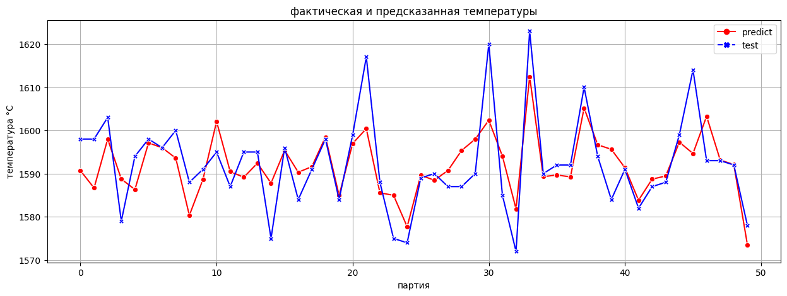

# **Оптимизация расходов металлургического комбината**  
Проект завершен  
[ipynb](steel_temperature.ipynb)  
## Описание проекта
Задача:  Чтобы оптимизировать производственные расходы, металлургический комбинат ООО «Так закаляем сталь» решил уменьшить потребление электроэнергии на этапе обработки стали. Нам необходимо построить модель, которая предскажет температуру стали.

Описание этапа обработки:
- > Сталь обрабатывают в металлическом ковше и подогревают до нужной температуры графитовыми электродами.
- > Перед тем как первый раз ввести легирующие добавки, измеряют температуру стали и производят её химический анализ.
- > Потом температуру на несколько минут повышают, производится десульфурация, добавляют легирующие материалы — подавая куски сплава из бункера для сыпучих материалов или проволоку через специальный трайб-аппарат и продувают сплав инертным газом.

- > Затем его перемешивают и снова проводят измерения. Такой цикл повторяется до достижения целевого химического состава и оптимальной температуры плавки.

- > Тогда расплавленная сталь отправляется на доводку металла или поступает в машину непрерывной разливки. Оттуда готовый продукт выходит в виде заготовок-слябов.

Описание данных:
- `data_arc_new.csv` — данные об электродах;
- `data_bulk_new.csv` — данные о подаче сыпучих материалов (объём);
- `data_bulk_time_new.csv` *—* данные о подаче сыпучих материалов (время);
- `data_gas_new.csv` — данные о продувке сплава газом;
- `data_temp_new.csv` — результаты измерения температуры;
- `data_wire_new.csv` — данные о проволочных материалах (объём);
- `data_wire_time_new.csv` — данные о проволочных материалах (время). 
Во всех файлах столбец `key` содержит номер партии.
---
## Выводы:

1. **Исследовав данные:**
 - ознакомились с данными о представленном этапе обработки стали
 - обнаружили пропуски и аномалии в значениях
 - ознакомились с распределением значений
 - составили план работы
 - провели уточнение цели нашей работы и особенностей технологического процесса

2. **В ходе предобработки:**
 - отобрали подходящие партии
 - удалили пропуски
 -> сгенерировали признаки, рассчитывали их в сумме на партию (ковш):
    - `input_temp` - температура на входе, удалили аномалии температура < 1400
    -	`output_temp` - температура выхода, целевой, удалили аномалии температура < 1400
    -	`all_time` - общее время на партию
    -	`heatig_time` - время нагрева
    -	`work` - работа (активная мощность * время) удален из-за высокой корреляции с 'heatig_time'
    -	`power_factor` - фактор мощности, отношение активной мощности к полной
    -	`full_power` - полная мощность, корень квадратный из суммы квадратов активной и реактивной мощности
    -	`heating_score` - количество нагревов,  удален из-за высокой корреляции с 'power_factor'
    -	`sum_bulk` - общий объем сыпучих материалов
    -	`score_bulk` - количество сыпучих добавок
    -	`wire_1` - проволочная добавка wire_1
    -	`sum_wire` - общий объем проволочных материалов
    -	`score_wire` - количество проволочных  добавок
    -	`gas` - объем газа
    -	`relative_time` - отношение времени нагрева к общему времени
    -	`rel_ingred_score` - отношение количества добавок к количеству нагревов
 - удаление выбросов (температуры и реактивной мощности) в обучающей выборке вело к ухудшению модели
 - исследовали мультиколлинеарность
 - подготовили данные к этапу моделирования
3. **Выбор модели и тестирование:**
 - удалось подобрать модель: LGBMRegressor с гиперпараметрми:`objective='poisson', learning_rate=0.1, max_depth=2, n_estimators=450, random_state=rs, rs=np.random.RandomState(80523)`, MAE на тесте: 6.22
 - провели анализ важности признков с помощью "shap"
<kbd>
 
</kbd>

4. **Сложности:**
- статистически почти во всех признаках есть выбросы, по информации заказчика такие значения возможны, аномалии – не ошибки, однако они затрудняют работу модели; из этого следует потребность в большем количестве данных, возможно это решит проблему и модель лучше адаптируется, либо весь процесс легирования недостаточно стабилен, а его "предсказуемость" также существенно влияет на результат. Из графика выше хорошо видно, что модель улавливает пик, но недостаточно хорошо отрабатывает его. 

**Заключение:**
Наша модель LGBMRegressor с MAE на тесте: 6.22, означает, что в среднем модель ошибается на 6.22 градуса, эта точность соответствует условиям заказчика.

После анализа важности признаков, выявили, что наибольшее влияние на температуру выхода влияет температура партии на входе и время нагрева, для не допускания перегрева следует обратить внимание именно на эти показания, если их возможно контролировать и регулировать. Однако выводы сделаны лишь по представленным  данным определенного этапа общего процесса обработки стали, возможно влияние оказывают факторы недоступные в представленных данных. Для более подробного исследования факторов влияющих на перегрев необходимо исследование по большему количеству данных (например данные о хим.составе), описывающих процесс более детально.
